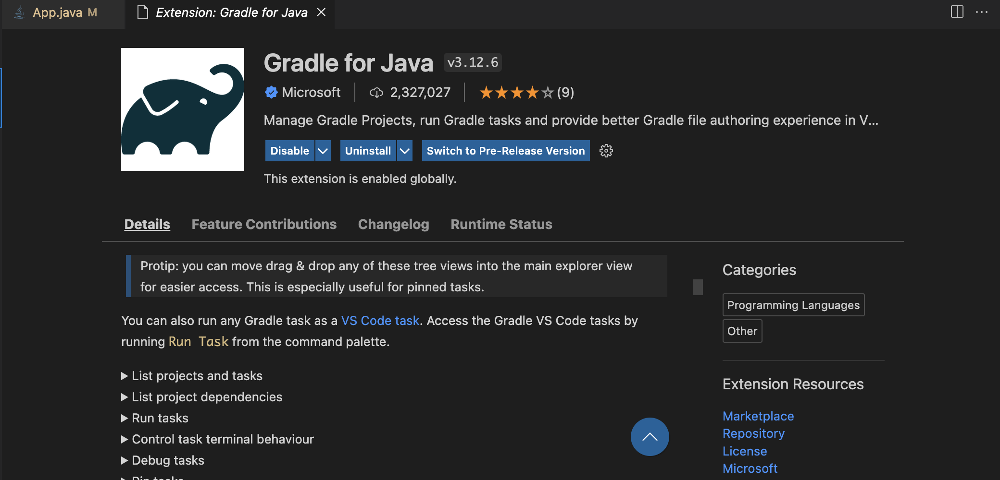
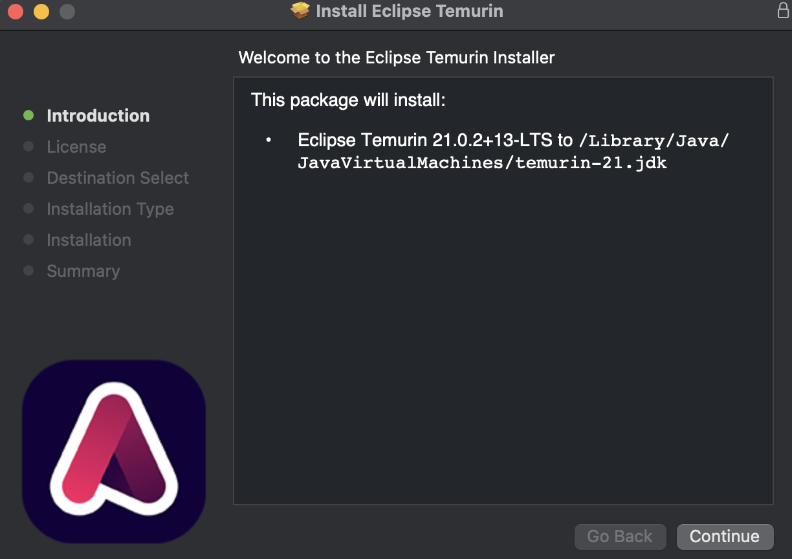
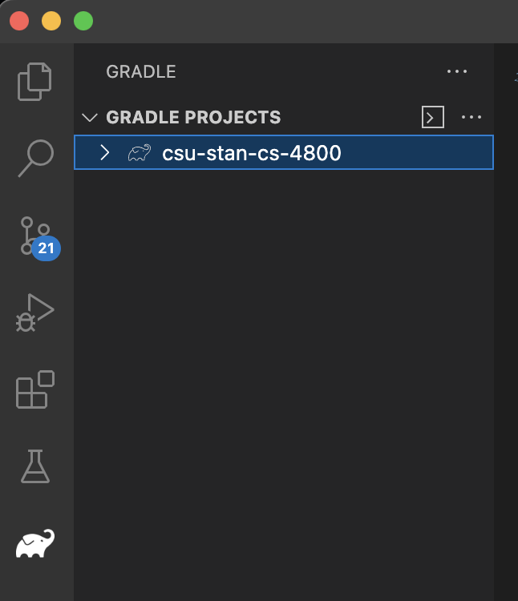
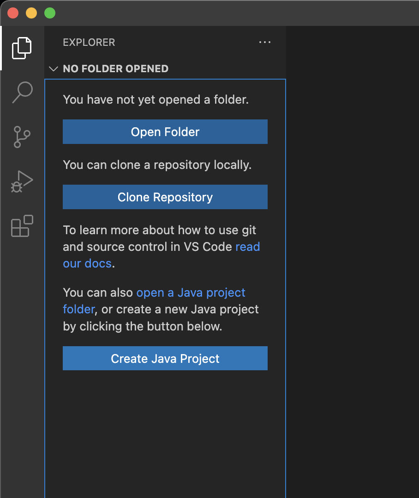
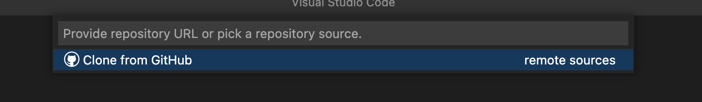

# Getting Started

First make sure that you have the Java and Gradle plugins for you IDE of Choice

## Setting Up VSCode
In VSCode these are the two extensions I recommend you use

When you download the extension you should see an Elephant in the side bar of VSCode.

## Java Reminder
Make sure that OpenJDK is downloaded as well, if your extesnions need that to be installed

## Clone the Repository
If your using VS Code you want to clone this repository when you start coding.

After clicking on the clone repository button, put the url of this git repository into the prompt and it should clone the repository for you

## Running the Gradle Project
Once we have Gradle installed we should test to see that it works. You have cloned the repository and installed the extensions. Now click on the elephant and click the "arrow in a box" button as seen on the top right of this image.

if a prompt comes up just type "run" ( REMOVE THE QUOTATION MARKS ) and it should run the program. If a command prompt comes up and prints "Goodbye Space" you are good to go.

As of now you will have to switch back and forth between the elephant and the normal code editor to run the code but Im looking for a way to make that simpler in the future.

## Other IDE

If you are using a different IDE we can set up a time to figure out how to use extensions that allow you to use gradle and java

## More Information
More Stuff will be written here as the project comes along. Make sure to come back here to read more especially in the first few weeks.
